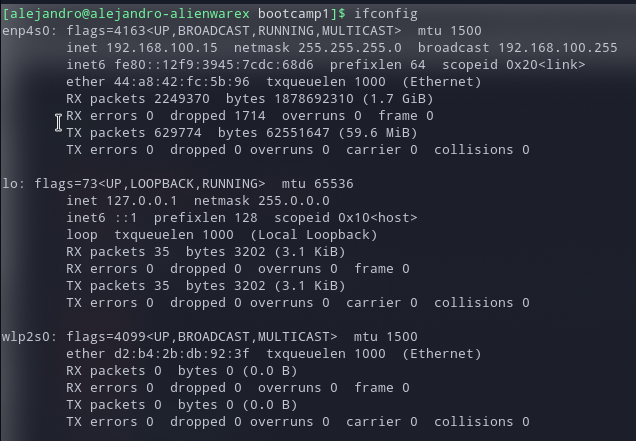
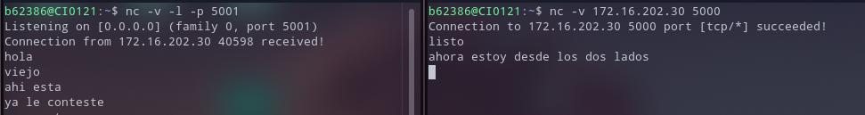
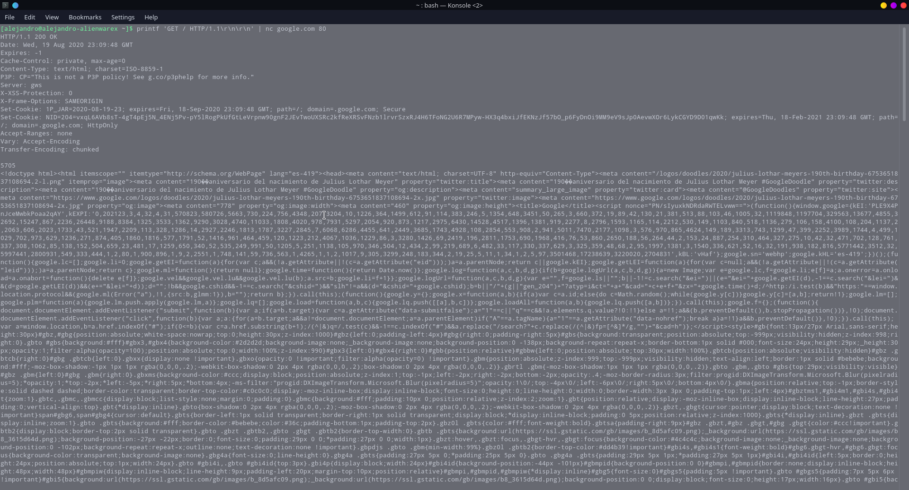
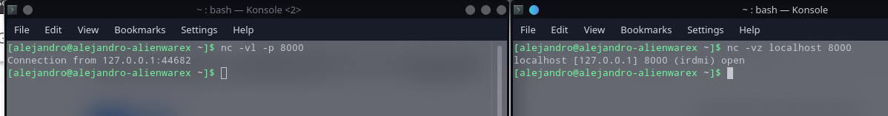

```
Alejandro Duarte Lobo
B62386
```
# Bootcamp 1 de Redes
## Interfaces, direcciones y Herramientas
### Pregunta 1:
1. Intefaz de red: Una interfaz de red se definió como cualquier manera que tenga un dispositivo para enviar o recibir bits desde el exterior.  
2. Como se identifica: Se pueden identificar con diferentes comandos en la computadora para mostrar los componentes de hardware que esta posee, asi como los componentes o configuración de red, como es el caso del comando `ifconfig`
3. Interfacesde red en una computadora o laptop:   
     * WiFi
     * Bluetooth
     * GPS
     * USB
     * Conexión por cable ethernet o placa de red.



La captura de pantalla anterior es el resultado de  ejecutar `ifconfig` en mi computadora. Se pueden observar detalles importantes como:  
* enp4s0: Corresponde al acceso a internet por **cable ethernet**.
  * mtu: Corresponde a las siglas de Maximum Transfer Unit, referente a la cantidad máxima de bytes por transferencia de datos.
  * inet: Corresponde al IP asignado a esta interfaz de red, este puede cambiar.
  * netmask: Sirve para identificar que parte de la dirección IP es el número de **red** y que parte corresponde al **host**.
  * broadcast: Es el resultado de poner todos los bits correspondientes al host en 1.
  * inet6: Corresponde a la dirección IPv6
  * ether: Corresponde a la dirección MAC de la computadora, la cual es única y no cambia.

  * txqueuelen: Transmit Queue Length,c corresponde a la cola de transmisión de datos del dispositivo.
* wlp2s0: Corresponde al acceso a internet por **WiFI**.
  * Como se pude observar, no aparecen la mayorria de los datos mencionados anteriormente ya que en el momento de tomar esta captura de pantalla, el WiFI no estaba activo en la computadora.

### Pregunta 2:
1. Host: Identifica un dispositivo o interfaz  dentro de una red TCP/IP, corresponde a los últimos bits de la IP.
2. Red:  Corresponde a los primeros bits de la IP, y corresponde a la red a la cual estan conectados los dispositivos.

En la capura de pantalla anterior podemos observar en enp4s0 la dirección inet que corresponde a `192.168.100.15`. En esta los primeros 3 bytes corresponden a la red, y el último byte al host.  
El número correspondiente a la red se consigue realizando una operación AND con la mascara de red (`255.255.255.0` en este caso.), la cual nos daría  como resultado `192.168.100.0`. El `15` corresponde al identificador del host.

Fuera del número de red (corresondiente a poner los últimos bits en 0), y el número de broadcast (correspondiente a poner los últimos bits en 1), todo lo que esta en medio puede corresponder a diferentes dispositivos o interfaces en la red. En este caso, entre 1 y 254.

### Pregunta 3:
La interfaz **loopback** corresponde a una interfaz de red virtual que usa la computadora para conectarse con si misma. De esta manera la computadora puede conectarse, por ejemplo, a servidores o servicios web que estan instalados dentro de si misma, esta función puede ser usada por diferentes aplicaciones. también es utilizada para testing y troubleshooting. **Esta interfaz no es accesible desde el exterior.** En general se puede decir que es un medio para que el host acceda a sus propios servicios de red.  

El nombre **localhost** es un hostname que corresponde a la dirección **127.0.0.1**, que a su vez corresponde a la dirección IP de loopback que se utiliza para referirse a "**esta computadora**", y no es visible desde el exterior.

### Pregunta 4:
**Firewall:** Es un programa utilizado para controlar el acceso de una computadora a la red y de esta manera, por ejemplo, bloquear accesos no autorizados. Este puede ser hardware, software, o una combinación de ambas.  

Para verificar si el firewall esta operativo se puede usar el comando:  
```console
user@pc:$ sudo ufw status verbose

```
Para **deshabilitar** el firewall se utiliza el comando:  
```console
user@pc:$ sudo ufw disable

```
también se puede utilizar iptables el cual utiliza un archivo para establecer reglas en la red.

### Pregunta 5:
Un puerto es un valor definido por el sistema operativo que se usa para identificar a los diferentes dispositivos que se intentan conectar a un mismo host.

Si un puerto esta en uso, este no puede ser utilizado por otro socket, daria un error de que este puerto esta ocupado al momento de intentar hacer el bind del socket.

Los puertos bien conocidos son puertos que se utilizan normalmente para tareas especificas. Estos van de 0 a 1024. Estas tareas han sido asignados a dichos puertos para seguir un estándar o protocolo a nivel mundial.

### Pregunta 6:



Como se puede observar en la captura de pantalla anterior, se utilizó nc para realizar una conexión desde red local con uno de mis compañeros de clase.  
* En la consola de la izquierda actué como **servidor** con el comando `nc -v -l -p 5001`, despues de ejecutar este comando se empieza a escuchar en el puerto 5001 para aceptar y realizar una conexión *TCP*. Una vez recibida y aceptada la conexión pudimos intercambiar mensajes de texto sencillos.  
* En la consola de la derecha actué como **cliente** con el comando `nc -v 172.16.202.30 5000`, despues de ejecutarse, se hace una petición de conexión a mi compañero que esta actuando como servidor y escuchando en el puerto 5000. Despues de ser recibida y aceptada, igual que en el punto anterior pudimos intercambiar mensajes sencillos.  

Nota: también se puede realizar una conexión **UDP** con la opcion `-u`

### Pregunta 7:
Utilicé el comando `printf 'GET /index.html HTTP/1.1\r\n\r\n' | nc google.com 80` para obtener el archivo index.html del webserver de Google y la respuesta fue la siguiente:


### Pregunta 8:

